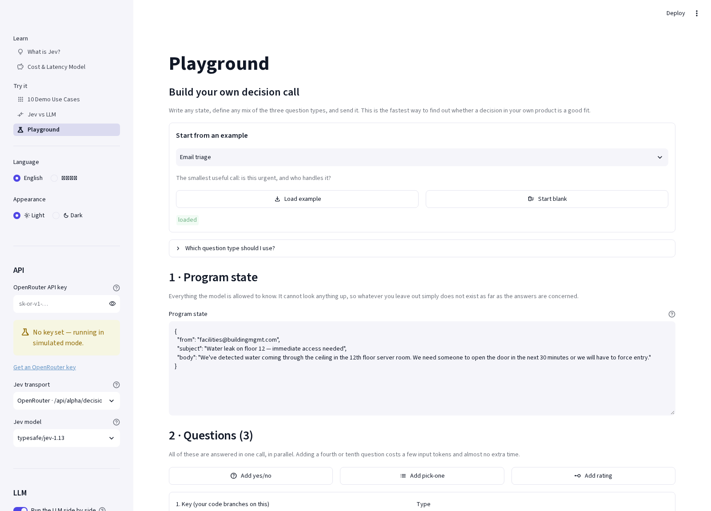
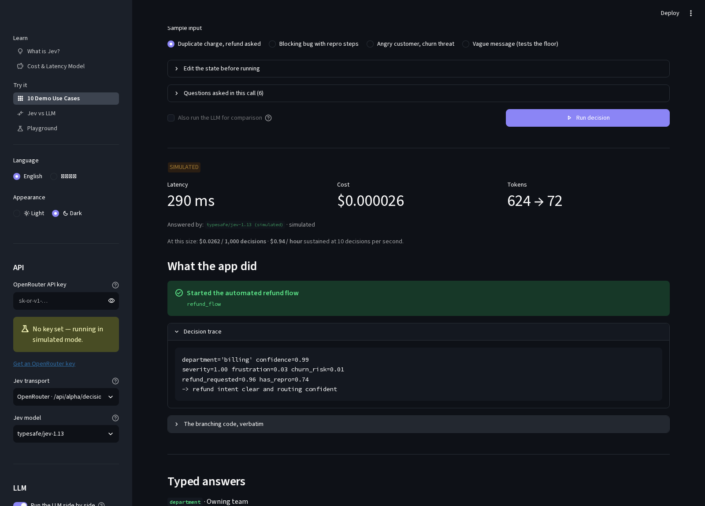

# Jev vs LLM — a TypeSafe System One demo

[繁體中文說明](README.zh-TW.md)

An interactive Streamlit app for understanding [TypeSafe AI's **Jev**](https://typesafe.ai/blog/introducing-system-one-models-and-jev)
— the first public *System One* model — by putting it side by side with a
general-purpose LLM on the same work.

Jev does not write text. You hand it program state and a set of typed questions,
and it answers all of them in one parallel pass, returning typed values with
calibrated probabilities. The pitch is that it behaves like a function call
rather than a conversation:

> unstructured state in → typed probabilistic decisions out

This repo exists to make that concrete: **ten working demo apps** where typed
decisions drive ordinary Python, plus a side-by-side harness that measures
latency, cost, agreement, and schema conformance against an LLM given the exact
same questions.

---

## Contents

- [What you get](#what-you-get)
- [Quickstart](#quickstart)
- [Configuration](#configuration)
- [The three primitives](#the-three-primitives)
- [How the API call works](#how-the-api-call-works)
- [The ten demo use cases](#the-ten-demo-use-cases)
- [How the LLM comparison is kept fair](#how-the-llm-comparison-is-kept-fair)
- [Simulated mode](#simulated-mode-no-api-key)
- [Project layout](#project-layout)
- [Caveats worth reading](#caveats-worth-reading)
- [Attribution](#attribution)

---

## What you get

Five pages, all available in **English and Traditional Chinese (繁體中文)**,
switchable from the sidebar at any time:

| Page | What it does |
|---|---|
| **What is Jev?** | Explains System One models, RLCD, and the three question types, with a full comparison table against LLMs and an honest caveats section. |
| **Cost & Latency Model** | Project the decision layer of a workflow out to your own volume, including the cascade pattern where Jev decides which requests deserve an LLM. |
| **10 Demo Use Cases** | Ten small working apps. Each shows the state, the questions, the typed answers, the resulting action, a decision trace, and the **verbatim branching code** that produced it. |
| **Jev vs LLM** | Same state, same questions, both engines, run concurrently. Measures latency, cost, per-question agreement, and schema violations, laid out so the two sides stay aligned row by row. |
| **Playground** | Eight ready-made scenarios to load in one click, then a stepped editor — state, questions, run — with typed quick-add buttons for each of the three question types. |

### A look at it

Each demo shows the decision, the action ordinary code took, and the trace that
justifies it:


Every answer arrives typed, with its full probability distribution and a
calibrated confidence:


And the cost model makes the case for the cascade pattern concrete:


The playground opens on a loadable example, with a stepped editor and one
quick-add button per question type:



Dark mode is a sidebar toggle, and applies everywhere:



> Screenshots were taken in simulated mode with no API key, which is why the
> `SIMULATED` badge is present and why the two-engine comparison layout is not
> shown — it needs a real LLM response. The `繁體中文` sidebar option renders as
> boxes only because the capture container has no CJK font installed; it
> displays correctly in a real browser.

---

## Quickstart

Requires **Python 3.10+**.

```bash
git clone https://github.com/eric-chen-igs/jev-260921-demo.git
cd jev-260921-demo

python3 -m venv .venv
source .venv/bin/activate          # Windows: .venv\Scripts\activate
pip install -r requirements.txt

streamlit run app.py
```

The app opens at <http://localhost:8501>. It runs immediately with no key in
[simulated mode](#simulated-mode-no-api-key); paste an
[OpenRouter key](https://openrouter.ai/keys) into the sidebar to make real calls.

---

## Configuration

Everything is settable from the sidebar, so no configuration file is required.
For convenience you can also seed defaults from the environment:

```bash
cp .env.example .env
```

| Variable | Purpose | Default |
|---|---|---|
| `OPENROUTER_API_KEY` | Pre-fills the sidebar key field. | — |
| `JEV_MODEL` | Jev slug to use. | `typesafe/jev-1.13` |
| `COMPARE_LLM_MODEL` | Comparison LLM. | `google/gemini-3.8-flash` |

Streamlit secrets (`.streamlit/secrets.toml`) are also read if present. The key
is held in the browser session only — the app never writes it to disk.

Sidebar settings: language, **light/dark appearance**, API key, Jev transport,
Jev model, comparison LLM with a regional-availability filter, an LLM on/off
toggle, and an advanced group for reasoning effort, temperature, and request
timeout.

### Why the Jev model is pinned by default

The picker defaults to `typesafe/jev-1.13` rather than `typesafe/jev-latest`.
TypeSafe's own advice is to pin once you have tuned thresholds, because
`jev-latest` follows new releases and answers can shift underneath you. Every
threshold in the ten demos was chosen against 1.13, so pinning is what keeps
them reproducible. `typesafe/jev-latest` is still one click away in the picker,
and the response's `model` field always reports the exact versioned release that
answered.

### Regional availability of comparison models

This demo is used from Hong Kong, where two of the major vendors do not offer
service, so the comparison picker is filtered by default:

| Vendor | Hong Kong | In the default list? |
|---|---|---|
| Google (Gemini) | Available — opened to Hong Kong in March 2026 | Yes |
| DeepSeek, Alibaba (Qwen), Moonshot (Kimi), Zhipu (GLM), MiniMax | Available | Yes |
| Mistral, Meta (Llama) | Available | Yes |
| **OpenAI** | Publishes an allow-list of supported countries and treats anything absent as unsupported. Hong Kong is absent. | No |
| **Anthropic** | Supported-countries list runs *…Honduras, Hungary…* with no Hong Kong entry; `claude.ai` geofences the territory. | No |
| **xAI (Grok)** | No clear published position either way. | No — not assumed safe |

There is a real nuance here, which is why those models are *hidden rather than
deleted*. Calls in this app go through OpenRouter, so the upstream request is
made by OpenRouter's infrastructure and not from your own IP. Whether that
satisfies a given vendor's terms is a compliance judgement for whoever operates
the demo, not something this app should quietly decide. So the sidebar has a
**"Show models not offered in Hong Kong"** checkbox, off by default, which
reveals them with the specific reason attached. Any slug can also be typed
directly into the picker.

One knock-on effect worth flagging: TypeSafe's launch write-up compares Jev
against GPT-5.6 Terra, which is in the restricted group. The prose on the *What
is Jev?* page still cites those published figures, but reproducing that exact
pairing needs the checkbox enabled.

### Light and dark mode

The sidebar has an **Appearance** control. Streamlit has no public API for
switching themes at runtime — `st.set_option` explicitly refuses `theme.base` —
so `jevdemo/theme.py` sets it through the internal config module and reruns,
which the frontend does pick up. Two caveats are documented in that module:
it is a private API and degrades to a no-op rather than raising if a future
release locks it down, and Streamlit config is process-global rather than
per-session, so on a shared deployment one visitor's choice repaints the app for
everyone. Fine for a local demo; not a pattern to copy into production.

---

## The three primitives

The entire API surface is three question types. That is the design, not a
limitation to work around.

| Type | Question it answers | What comes back |
|---|---|---|
| **`noul`** | Is this statement true? | One calibrated probability, 0–1. The number *is* the belief, so there is no separate confidence field. |
| **`choice`** | Which one of these? | One option key from your set (up to 255), plus a probability per option and a confidence. |
| **`score`** | Where on this spectrum? | A continuous position across 2–10 ordered levels you describe, plus a confidence. May land between levels. |

Every question is answered in **one parallel pass** over the state. A tenth
question costs a few more input tokens and almost no extra time, which inverts
the usual instinct to make a cheap call first and follow up only if needed. Ask
everything up front, then let ordinary code decide what mattered.

In this repo those types live in [`jevdemo/schema.py`](jevdemo/schema.py) and are
shared by both engines, which is what makes the comparison meaningful.

---

## How the API call works

Jev is reachable two ways, and this app supports both (selectable in the sidebar).

| | OpenRouter | TypeSafe first-party |
|---|---|---|
| Endpoint | `POST https://openrouter.ai/api/alpha/decisions` | `POST https://api.typesafe.ai/v1/systemone` |
| Model slug | `typesafe/jev-latest` | `jev-latest` |
| Credential | OpenRouter key | TypeSafe key (early access, waitlisted) |

The body, the three question types, and the answer shapes are otherwise
identical. One difference this app normalises for you: OpenRouter requires
**both** the `true` and `false` descriptions on a `noul` whenever `criteria` is
present at all, while TypeSafe's API treats each side as independently optional.
Supply one side and [`jevdemo/schema.py`](jevdemo/schema.py) fills the other, so
the same question definition works on both transports.

### Request

```bash
curl https://openrouter.ai/api/alpha/decisions \
  -H "Authorization: Bearer $OPENROUTER_API_KEY" \
  -H "Content-Type: application/json" \
  -d '{
    "model": "typesafe/jev-latest",
    "state": {
      "ticket": "My checkout page shows a blank screen after I click Pay.",
      "customer_tier": "enterprise"
    },
    "questions": {
      "team": {
        "type": "choice",
        "instructions": "Which team should own this ticket?",
        "criteria": {
          "payments": "Checkout, billing, or payment processing issues.",
          "frontend": "Rendering, layout, or browser compatibility issues.",
          "account":  "Login, permissions, or profile issues."
        }
      },
      "urgency": {
        "type": "score",
        "instructions": "How urgent is this ticket?",
        "criteria": [
          "Can wait for the next release",
          "Should be fixed this week",
          "Blocking revenue right now"
        ]
      },
      "is_bug": {
        "type": "noul",
        "instructions": "Is the customer reporting a software defect?",
        "criteria": {
          "true":  "The customer describes broken or unexpected behaviour.",
          "false": "The customer is asking a question or requesting a feature."
        }
      }
    }
  }'
```

`state` may be a string, a JSON object, or an array. Text only — no images,
audio, or video.

### Response

```json
{
  "id": "gen-dec-1789738314-X5e5eKGQdvR9rblyX250",
  "model": "typesafe/jev-1.13-20260917",
  "provider": "TypeSafe",
  "answers": {
    "team": {
      "type": "choice",
      "choice": "payments",
      "confidence": 0.75,
      "probabilities": { "payments": 0.84, "frontend": 0.16, "account": 0.0 }
    },
    "urgency": {
      "type": "score",
      "score": 1.99,
      "confidence": 0.99,
      "probabilities": { "0": 0.0, "1": 0.01, "2": 0.99 },
      "legend": {
        "0": "Can wait for the next release",
        "1": "Should be fixed this week",
        "2": "Blocking revenue right now"
      }
    },
    "is_bug": { "type": "noul", "noul": 0.96 }
  },
  "usage": { "input_tokens": 476, "output_tokens": 70, "cost": 0.000019992 }
}
```

Note the `model` field: `jev-latest` resolves to a specific versioned release and
will move when a new one ships. Log what actually answered, and pin the version
if you have tuned thresholds against it.

### Consuming the answers

```python
# The answers are already typed, so this is just ordinary Python.
# No parsing, no validation, no retry-on-malformed-JSON.
answers = response["answers"]

if answers["is_bug"]["noul"] > 0.7:
    team = answers["team"]

    # One threshold per action, scaled to what being wrong costs.
    if team["confidence"] < 0.55:
        route_to_human(ticket)                     # the floor: genuinely unsure
    elif answers["urgency"]["score"] > 1.5:
        page_oncall(ticket, team=team["choice"])   # expensive, so a higher bar
    else:
        enqueue(ticket, team=team["choice"])
else:
    reply_with_docs(ticket)
```

That threshold-per-action shape is the part worth stealing. Because Jev is
trained with **RLCD** (Reinforcement Learning for Calibrated Decisions), which
optimises probabilities against outcomes rather than human preference, higher
confidence corresponds to higher accuracy in aggregate. So you stop writing one
threshold for a whole system and start writing one per action, scaled to the cost
of being wrong. A read-only lookup can fire at 0.5; moving money should not.

---

## The ten demo use cases

Every demo builds a state object, asks a set of typed questions, and then runs
plain Python over the answers to reach an outcome. The branching code is
displayed verbatim in the UI alongside a decision trace, because that is the
actual point: the interesting logic stays in your codebase where it is
reviewable and testable, and the model only supplies the judgements that are
awkward to express in code.

| # | Demo | Category | What it demonstrates |
|---|---|---|---|
| 1 | **Support ticket triage** | Classify & route | Confidence-gated routing. The floor is checked *before* any routing branch, and a retention signal outranks the topic. |
| 2 | **Content moderation guardrail** | Classify & route | Separating *signal detection* from *policy*. Quoting hate speech to condemn it is allowed; self-harm routes to support, never enforcement. |
| 3 | **Inbound lead qualification** | Classify & route | Composite scoring with weights that live in code, so re-weighting is a diff you can A/B test. |
| 4 | **On-call alert triage** | Classify & route | Suppression before escalation. Automated rollback demands four independent signals before firing unattended. |
| 5 | **Prompt injection guardrail** | Verify & filter | Eight signals in one sub-second call, with graded responses: allow, downgrade, strip, refuse, block. |
| 6 | **RAG relevance pre-filter** | Verify & filter | Map-reduce with one `noul` per passage, built dynamically from state. The filter costs less than the context window it saves. |
| 7 | **LLM output judge** | Verify & filter | Judging every output, not a sample. Quality problems regenerate; possible data disclosure stops for a human. |
| 8 | **Real-time game agent** | Real-time control | 10 Hz decisions where hard-coded survival reflexes keep the right to overrule the model on every tick. |
| 9 | **Browser agent action picker** | Real-time control | Speculative fan-out applied to actions: operation *and* every candidate target in one round trip. |
| 10 | **CV screening by composite score** | Score at scale | Decomposition into weighted dimensions — with no automated rejection, and the hard requirement deliberately not trusted to the model. |

A few are worth singling out.

**#6 and #9 build their questions from the state.** The RAG filter emits one
question per retrieved passage, and the browser agent rebuilds its action space
from each fresh page observation. See the `questions_builder` hook in
[`jevdemo/usecases/base.py`](jevdemo/usecases/base.py).

**#9 shows what "cannot generate" actually means in practice.** Jev does not
write the string to type into a form — it *selects which slot of your own goal
state* to type. The literal value always comes from your code, which is exactly
why nothing can be hallucinated into a form field.

**#8 and #10 show code keeping the veto.** The game agent overrides the model
when health is critical or ammunition is empty. The CV screener never
auto-rejects, and routes an apparently-unmet years-of-experience requirement to a
human because date arithmetic is a known weak spot rather than something to act
on unattended.

---

## How the LLM comparison is kept fair

It would be easy — and useless — to make an LLM look bad by penalising it for
being chatty. Instead, [`jevdemo/llm_client.py`](jevdemo/llm_client.py) gives it
every advantage:

- The **same question set** Jev receives is compiled into a strict JSON Schema
  and sent via `response_format: json_schema`, which is the most reliable way to
  get typed decisions out of a chat model. TypeSafe use the same approach for
  their own published comparisons.
- A system prompt explains each question type and explicitly asks for calibrated
  confidence.
- Both requests are issued **concurrently**, so neither waits on the other.
- Cost comes from OpenRouter's own billing field (`usage: {include: true}`),
  not from a price table.
- Reasoning effort and temperature are adjustable, so you can spend more on the
  LLM and watch what it buys.

The output is then parsed and validated, and **every violation is recorded and
shown**: an option outside the declared enum, a probability outside 0–1, a score
outside the declared range, a missing key, a bare scalar where an object was
required, or output that is not JSON at all. That count is the type-safety
comparison, measured rather than asserted.

The results are laid out to be *readable* as a comparison, which took some care.
A column per engine drifts out of step as soon as the two sides differ in height,
and they always do — an LLM reports several schema violations where Jev reports
none, and a five-option choice renders taller than a two-level score. Once the
columns are offset you are no longer comparing answers side by side. So every
section opens a fresh row, each question's two answers are always in the same
row with the question stated once above them, and a per-question badge marks
agreement. On the use-case pages there is one more row worth the trouble: the
LLM's answers are fed through the *same* branching code, so you can see whether
the application would actually have behaved differently. A disagreement that
changes the action is the only kind that matters.

Two honest notes on reading the results:

- **Agreement is not correctness.** Neither column is ground truth. A
  disagreement is an invitation to look at the input and decide which answer you
  would have written yourself.
- **Jev's 0 schema violations is structural, not empirical.** Its output space
  *is* the schema, so conformance is not something it can fail at. That is a
  narrower claim than "cannot be wrong" — see below.

---

## Simulated mode (no API key)

With no key, the Jev column is produced locally by a lexical-overlap heuristic
plus per-sample expected answers, so the whole interface stays explorable. It is
labelled `SIMULATED` everywhere it appears.

It is **not Jev**, and it is not an approximation of Jev's accuracy. It exists so
you can read the demos, see the branching code run, and understand the shape of
the API before deciding whether to get a key. The LLM column is unavailable in
this mode, because there is nothing meaningful to fake about a real model's
latency or token bill.

---

## Project layout

```
app.py                          Entry point: sidebar + st.navigation over five pages
requirements.txt
.env.example
.streamlit/config.toml

jevdemo/
  schema.py                     Noul / Choice / Score, Answer, DecisionResult.
                                Shared by both engines — the reason the
                                comparison is apples to apples.
  jev_client.py                 System One transports (OpenRouter / TypeSafe)
                                plus the offline simulator.
  llm_client.py                 The "System One LLM wrapper": JSON Schema
                                construction, prompt rendering, and the output
                                validator that counts schema violations.
  compare.py                    Runs both engines concurrently and computes
                                agreement, speed-up, and cost ratio.
  i18n.py                       English + Traditional Chinese strings.
  settings.py                   Sidebar menu -> AppSettings -> configured clients.
  theme.py                      Runtime light/dark switching, and the reasons
                                it has to be done the awkward way.
  playground_examples.py        Eight loadable playground scenarios.
  ui.py                         Shared rendering: answer cards, probability
                                bars, metrics, delta tables, and the aligned
                                two-engine comparison layout.
  usecases/
    base.py                     UseCase / Sample / Outcome, and the registry.
    cases_routing.py            Demos 1-4
    cases_verification.py       Demos 5-7
    cases_realtime.py           Demos 8-9
    cases_scoring.py            Demo 10

views/
  about.py                      What is Jev?
  compare.py                    Jev vs LLM
  usecases.py                   The ten demos
  playground.py                 Freeform question builder
  economics.py                  Cost & latency model
```

### A note on language and the wire

Only narrative and UI text is translated. The `instructions` and `criteria` sent
to the model stay in English in both interface languages, deliberately: it means
switching the UI language never silently changes the decision being measured.
Question definitions are model-facing artefacts, and you see them exactly as they
would appear in your own codebase.

---

## Caveats worth reading

This demo is an enthusiastic exploration of a genuinely new model class, but
**the performance figures it quotes are the vendor's own**. Four things are worth
holding onto.

**1. The benchmark column is not accuracy.** TypeSafe's workflow evaluation has
no ground truth. It builds consensus labels by averaging two frontier models
(GPT-6 Astra and Claude Fable 5.1 at high thinking) and scores everyone against
that average. It measures *agreement with two frontier models*, which is also
why neither appears in the results. TypeSafe note this biases the reference
toward OpenAI and Anthropic.

On that evaluation Jev scores 67.8%, level with GPT-5.6 Terra at 67.9% and
Claude Sonnet 5 at 67.8%, and behind GPT-5.6 Sol at 74.1% and Claude Opus 5 at
73.1% — at roughly 1/200th the cost and 1/50th the latency.

**2. It is self-run.** TypeSafe designed the workflows, built the harness, and
ran the evaluation. No independent reproduction exists yet. Evaluate on your own
traffic before trusting any of it.

**3. "Cannot hallucinate" is narrower than it sounds.** Jev cannot return a value
*outside your schema*. It can absolutely return the *wrong value from inside* it.
The published 0% type-error rate is asserted from the architecture rather than
measured: schema matching is structural, so 0% goes in the chart. The LLM
comparison figure of 45.5% is a single outlier; most models sit between 0.58% and
13.2%.

**4. The price may move.** TypeSafe cannot prove the pricing is not subsidised.
They say they expect it to fall rather than rise, but that is a forecast.

### Where Jev is known to be weak

TypeSafe publish a "jaggedness" page, which is unusually candid for a launch.
These limitations shaped several of the demos in this repo:

- **It reads literally.** Negations, scoping words, and implied conditions land
  at face value. If you catch yourself explaining what you *really meant*, that
  explanation was the missing half of your instruction.
- **It is not a calculator.** Counting is unreliable and the error grows with the
  size of the thing counted. Iterate in code and ask one `noul` per item.
- **Dates are text, not ordered quantities.** Which came first, how far apart,
  whether one falls in a window: all unreliable. Extract with a `choice` over
  enumerated values, then order and compare in code. (This is why demo #10
  refuses to act unattended on a years-of-experience check.)
- **Context rot is real.** Accuracy falls as the state fills with material the
  question does not need. Retrieve and filter first. (Demo #6.)
- **State is not treated as hostile.** Text engineered to argue for its own
  classification can move the answer. If user-controlled content goes into
  state, that is your threat model to handle. (Demo #5 is defence in depth, not
  a solved problem.)
- **It does not generate.** If you need a value extracted from free text, get
  candidates with a regex or a generative model and let Jev pick. (Demo #9.)

The meta-rule from their docs is good design advice regardless of model: do not
ask the model something code can compute exactly, and do not hide several
judgements inside one question.

### Verification status of this repo

Worth being explicit, since it affects how much you should trust the code before
running it yourself:

- **Verified.** Every page renders in both languages; all ten use cases run
  across all 37 sample inputs and produce their intended outcomes; all 37
  generated request bodies (247 questions in total) validate against the live
  `POST /api/alpha/decisions` request schema from
  <https://openrouter.ai/openapi.json>; the documented example response decodes
  correctly; the LLM output validator catches invented enum options,
  out-of-range values, missing keys, bare scalars, and non-JSON output; all
  eight playground examples build and validate against the same schema; the
  Hong Kong filter excludes every OpenAI, Anthropic and xAI slug by default; and
  the light/dark toggle was confirmed by reading the computed background of
  `.stApp` before and after switching (`#FFFFFF` → `#0E1117` → back).
  The aligned two-engine layout was checked against a deliberately lopsided
  stubbed LLM response — disagreements, a missing answer, and several schema
  violations — since that unevenness is the case the layout exists to handle.
- **Not verified.** No live call has been made against the real endpoint from
  this repo, because no API key was available while it was written. The wire
  format is built and schema-checked against OpenRouter's published
  specification, and the Decisions route is marked **alpha** by OpenRouter, so
  treat the first live run as the real test. Please open an issue if anything
  differs.

---

## Attribution

- [Introducing System One Models & Jev](https://typesafe.ai/blog/introducing-system-one-models-and-jev)
  — TypeSafe AI, the source for the model description, comparison table, and all
  performance figures quoted here.
- [Jev Latest on OpenRouter](https://openrouter.ai/~typesafe/jev-latest)
- [OpenRouter OpenAPI specification](https://openrouter.ai/openapi.json) — the
  `POST /api/alpha/decisions` schema this app is built and validated against.

Vendor material is summarised and paraphrased rather than reproduced. Content was
rephrased for compliance with licensing restrictions.

This is an unofficial demo. It is not affiliated with or endorsed by TypeSafe AI
or OpenRouter. Model names and trademarks belong to their respective owners.

## License

MIT — see [LICENSE](LICENSE).
