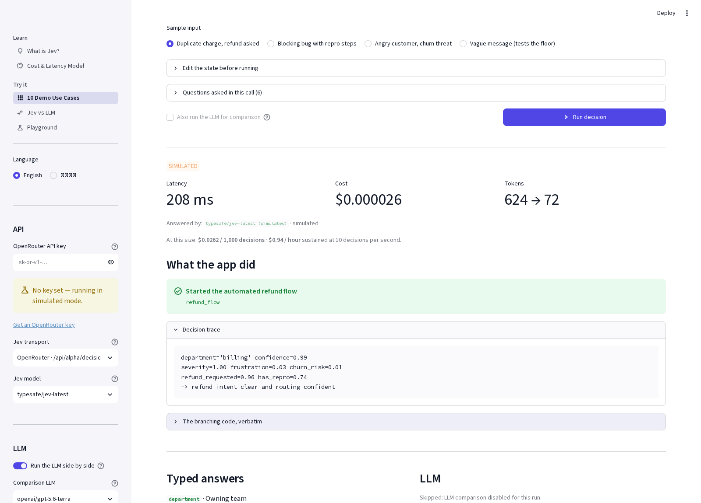
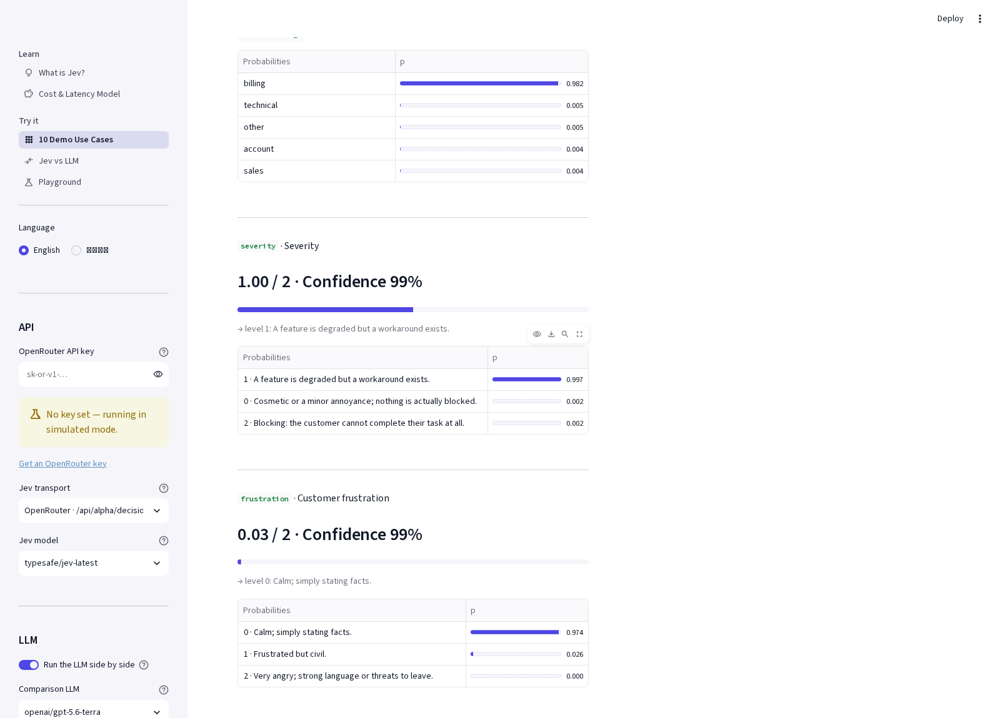
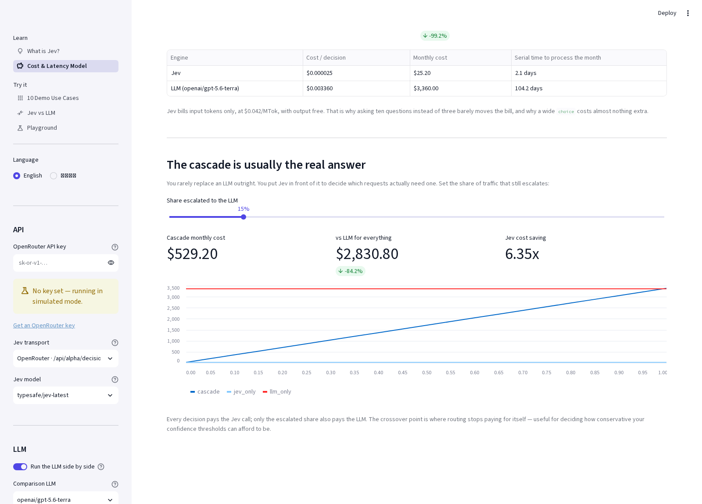

# Jev vs LLM — TypeSafe System One 示範專案

[English README](README.md)

一個互動式 Streamlit 應用，用來理解 [TypeSafe AI 的 **Jev**](https://typesafe.ai/blog/introducing-system-one-models-and-jev)
—— 第一個公開的 *System One* 模型 —— 方法是讓它與通用大型語言模型（LLM）在完全相同的任務上正面對照。

Jev 不產生文字。你交給它程式狀態與一組型別化問題，它會在單一次平行運算中回答全部問題，
並回傳帶有已校準機率的型別化數值。它的核心主張是：它的行為像一次函式呼叫，而不是一段對話。

> 非結構化狀態輸入 → 型別化的機率性決策輸出

這個專案的目的就是把這件事具體化：**十個可運作的示範應用**，展示型別化決策如何驅動普通的
Python 程式碼；另外再加上一套並排比較框架，在給予 LLM 完全相同問題的前提下，
量測延遲、成本、一致率與結構符合度。

---

## 目錄

- [你會得到什麼](#你會得到什麼)
- [快速開始](#快速開始)
- [設定](#設定)
- [三種基礎問題型別](#三種基礎問題型別)
- [API 呼叫的實際運作方式](#api-呼叫的實際運作方式)
- [十個示範應用](#十個示範應用)
- [如何確保與 LLM 的比較是公平的](#如何確保與-llm-的比較是公平的)
- [模擬模式（無 API 金鑰）](#模擬模式無-api-金鑰)
- [專案結構](#專案結構)
- [值得一讀的保留態度](#值得一讀的保留態度)
- [出處與致謝](#出處與致謝)

---

## 你會得到什麼

共五個頁面，全部提供**英文與繁體中文**兩種語言，可隨時從側邊欄切換：

| 頁面 | 功能 |
|---|---|
| **什麼是 Jev？** | 說明 System One 模型、RLCD，以及三種問題型別，附上與 LLM 的完整比較表，以及一節誠實的保留態度說明。 |
| **成本與延遲估算** | 把工作流程的「決策層」推估到你自己的流量規模，包含由 Jev 判斷哪些請求值得動用 LLM 的 cascade（層疊）模式。 |
| **10 個示範應用** | 十個可運作的小型應用。每個都會展示狀態、問題、型別化答案、最終動作、決策軌跡，以及產生該結果的**原始分支程式碼**。 |
| **Jev 與 LLM 對比** | 相同狀態、相同問題、兩種引擎並行執行。量測延遲、成本、逐題一致率與結構違規數。 |
| **自由實驗場** | 自行撰寫任意狀態、組合三種問題型別、檢視產生的請求主體並送出。 |

### 實際畫面

每個示範都會展示決策內容、普通程式碼實際採取的動作，以及支持該動作的軌跡：



每個答案都以型別化形式回傳，並附上完整的機率分布與已校準的信賴度：



成本模型則讓 cascade（層疊）模式的效益變得具體可見：



> 註：截圖是在無 API 金鑰的模擬模式下擷取的，因此會顯示 `SIMULATED` 標記。
> 側邊欄中「繁體中文」選項顯示為方框，是擷圖容器缺少中日韓字型所致，實際瀏覽器中可正常顯示。

---

## 快速開始

需要 **Python 3.10 以上**。

```bash
git clone https://github.com/eric-chen-igs/jev-260921-demo.git
cd jev-260921-demo

python3 -m venv .venv
source .venv/bin/activate          # Windows：.venv\Scripts\activate
pip install -r requirements.txt

streamlit run app.py
```

應用會開在 <http://localhost:8501>。未設定金鑰時會直接以
[模擬模式](#模擬模式無-api-金鑰) 運行；把
[OpenRouter 金鑰](https://openrouter.ai/keys) 貼進側邊欄即可進行真實呼叫。

---

## 設定

所有項目都可以在側邊欄設定，因此不需要任何設定檔。
若想預先帶入預設值，也可以使用環境變數：

```bash
cp .env.example .env
```

| 變數 | 用途 |
|---|---|
| `OPENROUTER_API_KEY` | 預先填入側邊欄的金鑰欄位。 |
| `JEV_MODEL` | 預設 Jev 模型代號，例如 `typesafe/jev-latest`。 |
| `COMPARE_LLM_MODEL` | 預設對比用 LLM，例如 `openai/gpt-5.6-terra`。 |

若存在 Streamlit secrets（`.streamlit/secrets.toml`）也會一併讀取。
金鑰僅保存在瀏覽器工作階段中 —— 本應用不會將它寫入磁碟。

側邊欄設定項目包含：API 金鑰、Jev 傳輸方式、Jev 模型、對比用 LLM、
LLM 開關、語言，以及一組進階設定（推理強度、temperature、請求逾時）。

---

## 三種基礎問題型別

整個 API 介面只有三種問題型別。這是刻意的設計，而不是需要繞過的限制。

| 型別 | 回答的問題 | 回傳內容 |
|---|---|---|
| **`noul`** | 這個陳述為真嗎？ | 單一已校準機率（0–1）。這個數字本身就是信念，因此沒有額外的信賴度欄位。 |
| **`choice`** | 是這幾個選項中的哪一個？ | 你定義的選項鍵之一（最多 255 個），並附上每個選項的機率與整體信賴度。 |
| **`score`** | 落在這個尺度的哪個位置？ | 在你描述的 2–10 個有序等級上的連續位置，並附上信賴度；數值可以落在等級之間。 |

所有問題都在對狀態的**單一次平行運算**中完成。第十個問題只會多花少量輸入 token，
幾乎不增加時間。這顛覆了「先發一個便宜的呼叫、必要時再追問」的慣性做法：
你應該一次問完所有問題，再讓一般程式碼決定哪些答案真正重要。

在本專案中，這些型別定義於 [`jevdemo/schema.py`](jevdemo/schema.py)，
並由兩種引擎共用 —— 這正是比較具有意義的原因。

---

## API 呼叫的實際運作方式

Jev 有兩種呼叫途徑，本應用皆支援（可於側邊欄切換）。

| | OpenRouter | TypeSafe 官方 |
|---|---|---|
| 端點 | `POST https://openrouter.ai/api/alpha/decisions` | `POST https://api.typesafe.ai/v1/systemone` |
| 模型代號 | `typesafe/jev-latest` | `jev-latest` |
| 憑證 | OpenRouter 金鑰 | TypeSafe 金鑰（早期存取，需排隊候補） |

除此之外，請求主體、三種問題型別與答案結構完全相同。
有一個差異由本應用替你統一處理：只要 `noul` 出現 `criteria` 欄位，
OpenRouter 就要求**同時**提供 `true` 與 `false` 的描述，
而 TypeSafe 的 API 則允許兩者各自獨立選填。
你只提供其中一側時，[`jevdemo/schema.py`](jevdemo/schema.py) 會自動補上另一側，
因此同一份問題定義在兩種傳輸方式上都能運作。

### 請求

```bash
curl https://openrouter.ai/api/alpha/decisions \
  -H "Authorization: Bearer $OPENROUTER_API_KEY" \
  -H "Content-Type: application/json" \
  -d '{
    "model": "typesafe/jev-latest",
    "state": {
      "ticket": "My checkout page shows a blank screen after I click Pay.",
      "customer_tier": "enterprise"
    },
    "questions": {
      "team": {
        "type": "choice",
        "instructions": "Which team should own this ticket?",
        "criteria": {
          "payments": "Checkout, billing, or payment processing issues.",
          "frontend": "Rendering, layout, or browser compatibility issues.",
          "account":  "Login, permissions, or profile issues."
        }
      },
      "urgency": {
        "type": "score",
        "instructions": "How urgent is this ticket?",
        "criteria": [
          "Can wait for the next release",
          "Should be fixed this week",
          "Blocking revenue right now"
        ]
      },
      "is_bug": {
        "type": "noul",
        "instructions": "Is the customer reporting a software defect?",
        "criteria": {
          "true":  "The customer describes broken or unexpected behaviour.",
          "false": "The customer is asking a question or requesting a feature."
        }
      }
    }
  }'
```

`state` 可以是字串、JSON 物件或陣列。僅支援文字 —— 不支援圖片、音訊或影片。

### 回應

```json
{
  "id": "gen-dec-1789738314-X5e5eKGQdvR9rblyX250",
  "model": "typesafe/jev-1.13-20260917",
  "provider": "TypeSafe",
  "answers": {
    "team": {
      "type": "choice",
      "choice": "payments",
      "confidence": 0.75,
      "probabilities": { "payments": 0.84, "frontend": 0.16, "account": 0.0 }
    },
    "urgency": {
      "type": "score",
      "score": 1.99,
      "confidence": 0.99,
      "probabilities": { "0": 0.0, "1": 0.01, "2": 0.99 },
      "legend": {
        "0": "Can wait for the next release",
        "1": "Should be fixed this week",
        "2": "Blocking revenue right now"
      }
    },
    "is_bug": { "type": "noul", "noul": 0.96 }
  },
  "usage": { "input_tokens": 476, "output_tokens": 70, "cost": 0.000019992 }
}
```

請注意 `model` 欄位：`jev-latest` 會解析到某個特定版本，並在新版本發布時跟著改變。
請記錄實際回應的版本；若你已針對某版本調校門檻值，建議鎖定版本。

### 使用這些答案

```python
# The answers are already typed, so this is just ordinary Python.
# No parsing, no validation, no retry-on-malformed-JSON.
answers = response["answers"]

if answers["is_bug"]["noul"] > 0.7:
    team = answers["team"]

    # One threshold per action, scaled to what being wrong costs.
    if team["confidence"] < 0.55:
        route_to_human(ticket)                     # the floor: genuinely unsure
    elif answers["urgency"]["score"] > 1.5:
        page_oncall(ticket, team=team["choice"])   # expensive, so a higher bar
    else:
        enqueue(ticket, team=team["choice"])
else:
    reply_with_docs(ticket)
```

「每個動作各自設定門檻」這個寫法最值得借用。由於 Jev 使用 **RLCD**
（Reinforcement Learning for Calibrated Decisions，校準決策強化學習）訓練，
其最佳化目標是「機率與實際結果的吻合程度」而非「人類偏好」，
因此整體而言較高的信賴度確實對應較高的正確率。
於是你不再為整個系統寫死同一個門檻值，而是**針對每個動作**設定門檻，
並依「做錯的代價」來調整。唯讀查詢可以在 0.5 就執行；但涉及金流的動作就不該如此。

---

## 十個示範應用

每個示範都會建立狀態物件、提出一組型別化問題，然後以普通的 Python 程式碼處理答案並得出結果。
分支邏輯的程式碼會連同決策軌跡一起在介面中原樣呈現，因為這正是重點所在：
真正重要的邏輯留在你的程式庫中，可審查、可測試，
而模型只負責提供那些難以用程式碼描述的判斷。

| # | 示範 | 類別 | 展示重點 |
|---|---|---|---|
| 1 | **客服工單分流** | 分類與路由 | 以信賴度把關的路由。下限檢查排在**任何**路由分支之前，且留客訊號的優先權高於主題分類。 |
| 2 | **內容審核防護欄** | 分類與路由 | 將**訊號偵測**與**政策**分離。引用仇恨言論以加以批評是允許的；自傷風險一律導向支援資源，絕不進入懲處流程。 |
| 3 | **潛在客戶資格評估** | 分類與路由 | 複合評分，且權重存在於程式碼中，因此調整權重是一次可做 A/B 測試的程式碼差異。 |
| 4 | **值班告警分流** | 分類與路由 | 抑制判斷排在升級之前。自動回滾需要四個獨立訊號同時成立才會在無人監督下執行。 |
| 5 | **Prompt 注入防護欄** | 驗證與過濾 | 以單次不到一秒的呼叫取得八項訊號，並做出分級處置：允許、降級、剝除、拒絕、封鎖。 |
| 6 | **RAG 相關性前置過濾** | 驗證與過濾 | map-reduce 模式，依狀態動態為每段文字各建立一個 `noul`。過濾成本低於它所節省的上下文空間。 |
| 7 | **LLM 輸出評判** | 驗證與過濾 | 評判每一筆輸出，而非抽樣。品質問題自動重新生成；可能的資料外洩則停下來等待人工。 |
| 8 | **即時遊戲代理** | 即時控制 | 10 Hz 的決策頻率，且寫死的生存反射機制在每一個 tick 都保有推翻模型的權力。 |
| 9 | **瀏覽器代理動作選擇** | 即時控制 | 把「推測式扇出」套用在動作上：操作類型**與**所有候選目標在同一次往返中取得。 |
| 10 | **以複合分數篩選履歷** | 大規模評分 | 拆解為加權維度 —— 不進行自動拒絕，且硬性條件刻意不交給模型判斷。 |

其中有幾個特別值得一提。

**#6 與 #9 會依狀態動態建立問題。** RAG 過濾器會為每一段檢索到的文字各發出一個問題，
瀏覽器代理則會依每次新的頁面觀察重建其動作空間。
請參見 [`jevdemo/usecases/base.py`](jevdemo/usecases/base.py) 中的 `questions_builder` 掛鉤。

**#9 展示了「無法生成」在實務上的真正含義。** Jev 並不撰寫要填入表單的字串 ——
它是**從你自己的目標狀態中挑選要填入哪個欄位**。實際的字面值永遠來自你的程式碼，
這正是為什麼不可能有幻覺內容被填進表單欄位。

**#8 與 #10 展示了程式碼如何保有否決權。** 遊戲代理會在血量危急或彈藥耗盡時推翻模型決定。
履歷篩選器絕不自動拒絕，並且會把「看似未達成的年資條件」交由人工確認 ——
因為日期算術是已知的弱項，不該在無人監督下據此行動。

---

## 如何確保與 LLM 的比較是公平的

要讓 LLM 看起來很差其實很容易 —— 但也毫無意義：只要因為它「話多」就懲罰它即可。
相反地，[`jevdemo/llm_client.py`](jevdemo/llm_client.py) 給了它所有優勢：

- 把 Jev 收到的**同一組問題**編譯成嚴格 JSON Schema，並透過
  `response_format: json_schema` 送出 —— 這是從對話模型取得型別化決策最可靠的方式。
  TypeSafe 在他們自己公開的比較中也採用相同做法。
- 系統 prompt 會說明每一種問題型別，並明確要求提供已校準的信賴度。
- 兩個請求**並行發出**，因此不會互相等待。
- 成本取自 OpenRouter 自己的計費欄位（`usage: {include: true}`），而非 price table 推估。
- 推理強度與 temperature 皆可調整，讓你能在 LLM 上多花成本，並觀察多花的錢換到了什麼。

輸出接著會被解析與驗證，而**每一項違規都會被記錄並顯示出來**：
超出宣告列舉範圍的選項、落在 0–1 之外的機率、超出宣告範圍的分數、
缺少的鍵、應為物件卻回傳純量值，或根本不是 JSON 的輸出。
這個計數就是型別安全的比較 —— 是實際量測，而非口頭主張。

閱讀結果時有兩點必須誠實說明：

- **一致並不等於正確。** 兩邊都不是標準答案。出現分歧時，
  正是你該回頭檢視輸入、並判斷自己會寫下哪個答案的時機。
- **Jev 的「0 次結構違規」是結構性結果，而非實測數據。** 它的輸出空間**就是** schema，
  因此結構符合度不是它有可能失敗的項目。這是一個比「不會出錯」窄得多的主張 —— 詳見下方。

---

## 模擬模式（無 API 金鑰）

未設定金鑰時，Jev 欄位由本機的詞彙重疊啟發式規則、加上每個範例的預期答案產生，
讓整個介面仍可瀏覽探索。凡是出現之處，都會標示 `SIMULATED`（模擬資料）。

它**並非 Jev**，也不是對 Jev 正確率的近似。它的存在只是為了讓你能閱讀示範內容、
看見分支程式碼實際執行、並理解這個 API 的形狀，再決定是否要去申請金鑰。
此模式下 LLM 欄位無法使用，因為真實模型的延遲與 token 費用無從有意義地模擬。

---

## 專案結構

```
app.py                          進入點：側邊欄 + st.navigation，共五個頁面
requirements.txt
.env.example
.streamlit/config.toml

jevdemo/
  schema.py                     Noul / Choice / Score、Answer、DecisionResult。
                                由兩種引擎共用 —— 這是比較能夠「同基準」的原因。
  jev_client.py                 System One 傳輸層（OpenRouter / TypeSafe）
                                以及離線模擬器。
  llm_client.py                 「System One LLM 包裝層」：JSON Schema 建構、
                                prompt 渲染，以及計算結構違規數的輸出驗證器。
  compare.py                    並行執行兩種引擎，並計算一致率、速度倍率與成本比。
  i18n.py                       英文與繁體中文字串。
  settings.py                   側邊欄選單 -> AppSettings -> 已設定完成的用戶端。
  ui.py                         共用渲染元件：答案卡、機率條、指標、差異表。
  usecases/
    base.py                     UseCase / Sample / Outcome 與註冊表。
    cases_routing.py            示範 1-4
    cases_verification.py       示範 5-7
    cases_realtime.py           示範 8-9
    cases_scoring.py            示範 10

views/
  about.py                      什麼是 Jev？
  compare.py                    Jev 與 LLM 對比
  usecases.py                   十個示範
  playground.py                 自由問題建構器
  economics.py                  成本與延遲估算
```

### 關於語言與傳輸內容的說明

只有敘述文字與介面文字會被翻譯。送給模型的 `instructions` 與 `criteria`
在兩種介面語言下都維持英文，這是刻意的：如此一來，切換介面語言就永遠不會
悄悄改變被量測的那個決策。問題定義屬於面向模型的產出物，
你看到的就是它們在你自己程式庫中會呈現的樣子。

---

## 值得一讀的保留態度

這個示範專案對一個真正嶄新的模型類別抱持高度興趣，
但**它所引用的效能數據全都來自供應商自己**。有四件事必須放在心上。

**1. 那個基準分數欄位並不是「正確率」。** TypeSafe 的 workflow 評測沒有標準答案。
它以兩個前沿模型（GPT-6 Astra 與 Claude Fable 5.1，皆開啟高強度推理）的平均值建立共識標籤，
再用該平均值為所有模型打分。因此它衡量的是**與兩個前沿模型的一致程度**，
這也是為什麼這兩個模型本身不出現在結果中。TypeSafe 也指出，
這讓參考答案偏向 OpenAI 與 Anthropic。

在該評測中，Jev 得分 67.8%，與 GPT-5.6 Terra（67.9%）和 Claude Sonnet 5（67.8%）持平，
落後於 GPT-5.6 Sol（74.1%）與 Claude Opus 5（73.1%）—— 但成本約為 1/200，延遲約為 1/50。

**2. 這是供應商自行執行的評測。** 工作流程、測試框架與實際執行全由 TypeSafe 完成，
目前尚無獨立第三方複現。在信任任何數據之前，請先用你自己的真實流量進行評估。

**3.「不會產生幻覺」的範圍比字面上更窄。** Jev 不可能回傳**你的 schema 之外**的值，
但它完全有可能回傳 schema **之內的錯誤值**。公布的 0% 型別錯誤率是從架構推導而來，
而非實測：由於 schema 相符是結構性保證，所以直接在圖表填入 0%。
另一方面，LLM 對照組的 45.5% 是單一極端值，大多數模型落在 0.58% 到 13.2% 之間。

**4. 價格可能變動。** TypeSafe 無法證明目前定價沒有補貼。
他們表示預期價格會下降而非上升，但那僅是預測。

### Jev 已知的弱項

TypeSafe 公開了一個名為「jaggedness」（能力不平整）的頁面，
對一個新產品發布而言相當坦誠。這些限制也形塑了本專案中的數個示範：

- **它照字面理解。** 否定詞、限定範圍的詞語與隱含條件都會被字面採納。
  如果你發現自己正在解釋「我真正的意思是……」，那段解釋就是你指令中缺少的另一半。
- **它不是計算機。** 計數並不可靠，且誤差會隨被計數對象的數量增加而放大。
  請在程式碼中逐項迭代，對每個項目各問一個 `noul`。
- **日期對它而言是文字，不是有序數值。** 誰先誰後、相隔多久、是否落在某區間，全都不可靠。
  請用 `choice` 在列舉值中擷取，再於程式碼中排序與比較。
  （這正是示範 #10 拒絕在無人監督下處理年資檢查的原因。）
- **context rot（脈絡腐化）是真實存在的。** 當狀態塞滿問題不需要的內容時，正確率會下降。
  請先檢索並過濾。（示範 #6。）
- **它不會把狀態視為潛在惡意輸入。** 刻意設計、為自己爭取特定分類的文字可能影響答案。
  若使用者可控的內容會進入狀態，這就是你必須自行處理的威脅模型。
  （示範 #5 屬於縱深防禦的一層，而非已被徹底解決的問題。）
- **它不做生成。** 若你需要從自由文字中擷取某個值，請先用正規表達式或生成式模型取得候選項，
  再讓 Jev 從中挑選。（示範 #9。）

他們文件中的總則，不論用哪個模型都是好的設計建議：
不要問模型可以由程式碼精確算出的事情，也不要把多個判斷藏在同一個問題裡。

### 本專案的驗證狀態

這點值得明確說明，因為它會影響你在親自執行之前該對這些程式碼抱持多少信任：

- **已驗證。** 每個頁面在兩種語言下都能正常渲染；十個示範應用在全部 37 組範例輸入上
  都能執行並產生預期結果；全部 37 個產生的請求主體（共 247 個問題）
  都通過 <https://openrouter.ai/openapi.json> 上
  `POST /api/alpha/decisions` 的即時請求 schema 驗證；
  官方文件中的範例回應能被正確解析；
  LLM 輸出驗證器能攔截憑空產生的列舉選項、超出範圍的數值、缺少的鍵、
  純量值，以及非 JSON 的輸出。
- **未驗證。** 本專案尚未對真實端點發出任何實際呼叫，
  因為撰寫期間無法取得 API 金鑰。傳輸格式是依據 OpenRouter 公開的規格建構並完成 schema 檢查，
  而 OpenRouter 也將 Decisions 路由標記為 **alpha**，
  因此請把第一次實際執行視為真正的測試。若有任何不符，歡迎開 issue 回報。

---

## 出處與致謝

- [Introducing System One Models & Jev](https://typesafe.ai/blog/introducing-system-one-models-and-jev)
  —— TypeSafe AI，本專案中模型說明、比較表與所有效能數據的來源。
- [Jev Latest on OpenRouter](https://openrouter.ai/~typesafe/jev-latest)
- [OpenRouter OpenAPI 規格](https://openrouter.ai/openapi.json) ——
  本應用所依據並驗證的 `POST /api/alpha/decisions` schema。

供應商資料以摘要與改寫方式呈現，而非原文重製。
內容已為符合授權限制而改寫（Content was rephrased for compliance with licensing restrictions）。

本專案為非官方示範，與 TypeSafe AI 及 OpenRouter 無隸屬關係，亦未經其背書。
模型名稱與商標均屬其各自所有者。

## 授權

MIT —— 請參見 [LICENSE](LICENSE)。
